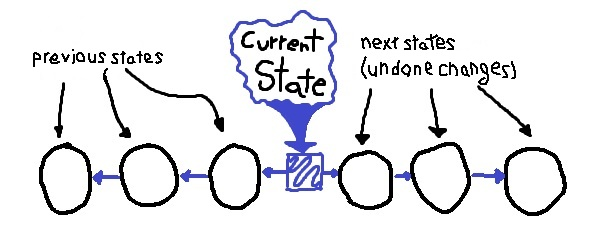
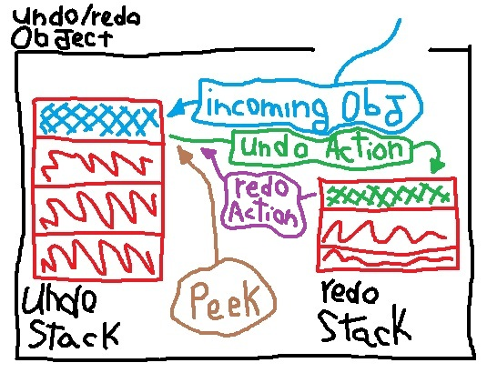

DP-undo-redo-example
====================

This repository is an attempt to implement the `undo-redo` feature
introduced at _Design Patters: Elements of Reusable Object-Oriented
Software_[^design-patterns-book] book (page 62/358).

Basically, the book give us a problem to be solved by the following
though:

_image 1: undo redo example_

The user is facing a program's state. It can go back to previous
states and also go to next states (since the `undo` store the states
which can be reaplied).

My solution approach is a `stack` based object: (suitable for
LIFO[^lifo] problems).

_image 2: solution approach_

Now, we can:
- insert incoming objects (states) in our `undo` stack,
- get the current state with `peek` (`undo` top state = current
  state),
- send top state from `undo` to `redo` stack whenever we call the
  _undo action_,
- send top element from `redo` to `undo` stack whenever we call the
  _redo action_,
- clear `redo` stack whenever a new states comes in our _"UndoRedo"_
  machine.

[^design-patterns-book]: Design Patters: Elements of Reusable
  Object-Oriented Software is a software engineering book that
  describes software design patterns. You can find it at
  [amazon website](https://www.amazon.com/Design-Patterns-Elements-Reusable-Object-Oriented/dp/0201633612).

[^lifo]: **LIFO** is a principle which dictates that the most
  recently added element to a collection is the first one to be
  removed or processed. This is analogous to a stack of plates.
